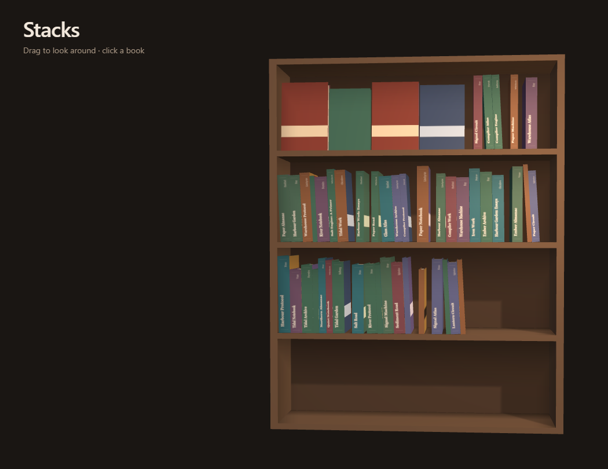

# Stacks

**A reading tracker where your Obsidian vault is the database — and your library
is a bookcase you can walk up to.**

`stacks add` writes a book note with structured frontmatter into your vault,
fetching the metadata and the cover for you. `stacks build` reads the vault back
and renders it as a 3D bookshelf you can publish as a plain static site.

There is no account, no server, no sync, and no second database. The notes are
the data. Delete this tool and you still have your library.



**[See a real one →](https://stacks.aymandiab.com)**

## Why it works this way

- **Your notes stay yours.** A published shelf carries covers and frontmatter —
  never note bodies. That rule is enforced by a gate that greps the built output
  for a phrase planted in a fixture note, rather than trusted.
- **Hand-editing is first-class.** Open any note in Obsidian and change it. The
  parser tolerates extra keys, reordered keys and missing ones; `stacks` rewrites
  individual frontmatter lines rather than re-serialising your YAML, so your
  comments and formatting survive byte for byte.
- **One bad note never breaks a build.** Malformed frontmatter is skipped with a
  warning naming the file.

## Quick start

You'll need **Node 22+**, **pnpm**, and an Obsidian vault (or any folder of
Markdown — nothing here requires Obsidian itself).

```bash
git clone https://github.com/mephistopheles4/stacks.git
cd stacks
pnpm install
cp .env.example .env
```

Set `STACKS_VAULT` in `.env` to your vault's path, then add a book:

```bash
pnpm stacks add "the left hand of darkness"
```

That looks the book up, downloads a cover into your vault, samples a spine
colour from the cover's binding edge, and writes `Library/The Left Hand of
Darkness.md`. Now look at your shelf:

```bash
pnpm dev:watch
```

Edit a note in Obsidian and the shelf follows about a second later.

> **A Google Books key is close to essential.** Open Library is the primary
> source and is thin on anything published in the last year or two. Without a key
> the fallback shares one global quota that is permanently exhausted, so it
> answers `429` every time. `.env.example` explains where to get one; it's free.

## Publishing your shelf

```bash
pnpm stacks build --public --vault /path/to/your/vault
pnpm --filter @stacks/site build
```

The result is `packages/site/dist/` — a static folder with no server behind it,
so it deploys as-is to Cloudflare Pages, GitHub Pages, Netlify, or anything that
serves files.

### What a public build actually exposes

Worth deciding on purpose, because this is the part that leaves your machine:

| Published | Never published |
| --- | --- |
| Title, author, ISBN | Note bodies — anything you wrote |
| Reading status, start and finish dates | Vault paths and filenames |
| Rating, tags, page count | Books marked `private: true` |
| Cover images, re-hosted at 512px | Wishlist books — you don't own them |

`private: true` **fails closed**: anything that isn't clearly a "no" keeps the
book unpublished, because `private: yes` is a *string* in YAML and a strict
boolean check would have published it. Wrongly private is a missing spine you
fix in a second; wrongly public may already have been crawled.

Covers are re-hosted from the provider that supplied them. That's a deliberate
choice with its reasoning written down — see [ADR-0013](docs/adr/0013-cover-provenance-and-rehosting.md) — and takedown
requests are honoured.

## Commands

| `pnpm stacks …` | What it does |
| --- | --- |
| `add` | fetch metadata and a cover, then write a note into the vault |
| `build` | parse the vault into `library.json` (`--public`, `--watch`) |
| `status` | books this year, in progress, covers still missing |
| `covers` | report where each cover came from, or record it (`--backfill`) |
| `enrich` | fill missing metadata on existing notes, never overwriting |
| `order` | show the shelf order, or renumber it (`--renumber`) |
| `import` | import a library export into the vault (`audible`) |

| Script | What it does |
| --- | --- |
| `pnpm dev` | site dev server |
| `pnpm dev:watch` | vault watcher + dev server, live-reloading |
| `pnpm test` | vitest, all workspaces and the gates |
| `pnpm typecheck` | `tsc --noEmit` across every `.ts` in the repo |
| `pnpm build` | typecheck + static site build |
| `pnpm worktree <branch>` | a second checkout, installed and pointed at your `.env` |
| `pnpm fixtures:50` | regenerate the 50-book fixture vault |
| `pnpm smoke:render` | headless shelf screenshot gate |
| `pnpm gate:public` | proves the public build leaks no note text |
| `pnpm deploy:site` | gates, then build from the real vault, then publish |

Both lists are documented in full in [CLAUDE.md](CLAUDE.md), and
`gates/commands.test.ts` holds that file to reality in both directions — adding
a command without documenting it there is a red build.

## Who this is for

**Developer-friendly personal software, not a packaged application.** There is
no npm release and no installer: the CLI runs from TypeScript source through
`tsx`, so using it means cloning this repo. If you're comfortable with a
terminal and Node, you'll be fine. If you're looking for an Obsidian plugin to
install, this isn't that yet.

All five phases are green and tagged (`phase-0` … `phase-4`) and it runs against
a real library daily. The invariants in [CLAUDE.md](CLAUDE.md) are the project's
**constitution**, and every article of it has a named gate that can go red —
scored in [docs/gates.md](docs/gates.md), which a gate holds to the constitution
in both directions so that coverage is a checked fact rather than a claim.

## Contributing

Contributions welcome — see [CONTRIBUTING.md](CONTRIBUTING.md). The short
version: `pnpm test && pnpm build && pnpm gate:public && pnpm smoke:render` is
the contract, and a defect worth fixing is usually worth a gate that goes red.

The repo also carries optional configuration for a set of
[engineering skills](https://github.com/mattpocock/skills) under
[`docs/agents/`](docs/agents/). **They are entirely optional** — nothing in the
workflow requires them, and every gate passes without a single one installed.

## Documentation

| | |
| --- | --- |
| [docs/progress.md](docs/progress.md) | where the project actually is — start here |
| [CLAUDE.md](CLAUDE.md) | the invariants and contracts that must not break |
| [docs/adr/](docs/adr/) | every choice made, and why |
| [docs/gates.md](docs/gates.md) | which rule each gate protects — and which are protected by nothing |
| [SECURITY.md](SECURITY.md) | the threat model, stated plainly |
| [docs/library-brief.md](docs/library-brief.md) | the original product spec (historical) |

`library.json` is a build artifact: always regenerable from the vault, never
hand-edited, gitignored.

## License

[MIT](LICENSE). The cover images a build downloads are not covered by it — they
belong to their publishers, and what you may do with them depends on which
provider supplied them.
